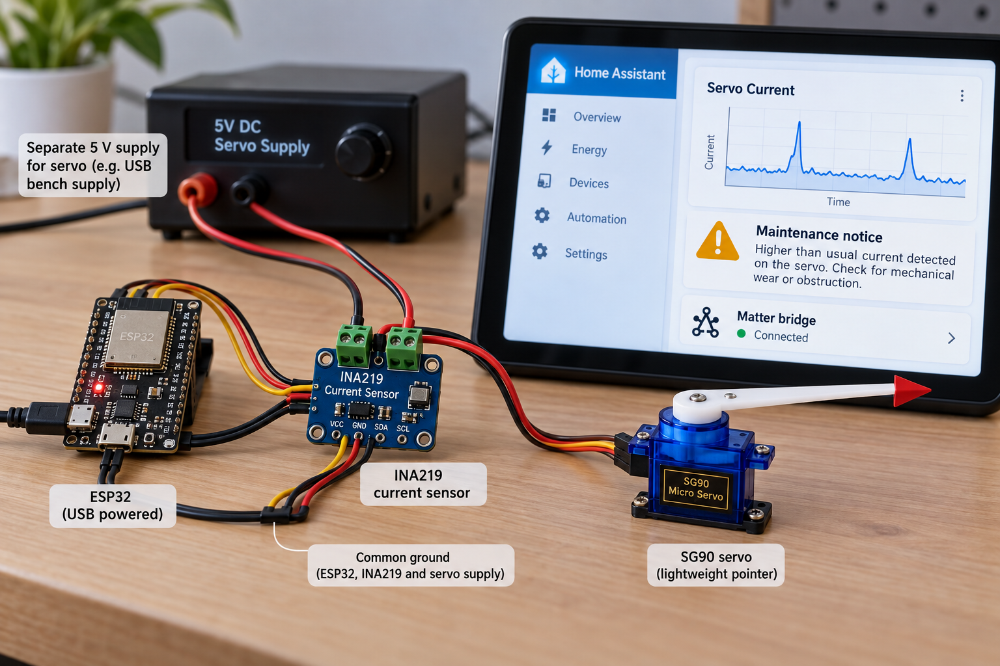
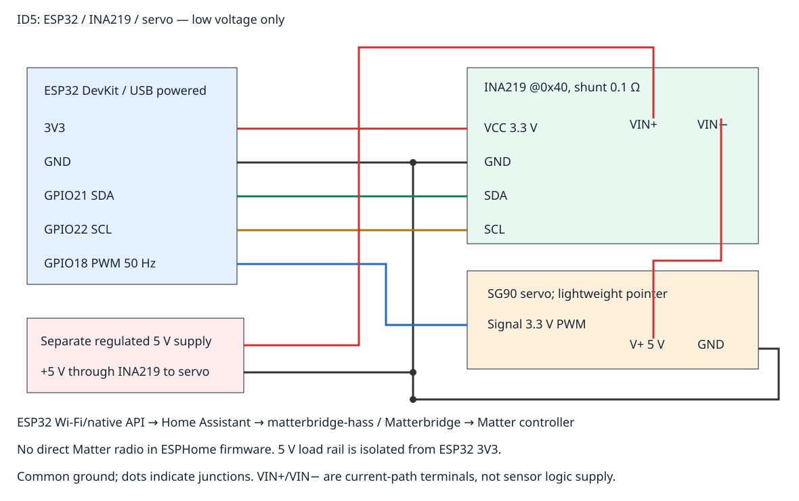

# Room Climate Hub Predictive Maintenance
This educational Home Assistant + ESPHome prototype monitors a small servo's current and flags sustained increases relative to a warmup baseline. It illustrates an early-warning **threshold heuristic**, not a validated prediction of equipment failure.



## Objectives and features
Acquire current with INA219, learn a 20-sample baseline, latch a warning after three consecutive elevated readings, reject invalid/overcurrent inputs, and inhibit new servo motions while warning or stale. Publish current and warning to Home Assistant and optionally bridge selected entities to Matter.

## Architecture and platform
ESP32 DevKit runs ESPHome with an INA219 and SG90 servo. Native API over Wi-Fi connects to Home Assistant. A separate **Matterbridge with matterbridge-hass** exposes Home Assistant entities to a Matter controller. The ESPHome firmware is not a native Matter endpoint; the extra hub bridge is required for roadmap Matter connectivity. No cloud service is needed on the prototype.

## Bill of materials
|Qty|Part|
|---:|---|
|1|ESP32 DevKit (esp32dev target), USB supply/cable|
|1|INA219 breakout, 0.1 Ω shunt, address 0x40, 3.3 V logic|
|1|SG90 positional servo with lightweight pointer|
|1|Separate regulated current-limited 5 V servo supply, adequate peak capacity|
|1 set|Jumper wires/breadboard and sensor terminal connections|
|1|Home Assistant host with ESPHome and Matterbridge application/plugin|
|1|Matter-compatible controller for optional commissioning|
Servo supply does not power ESP32 3V3. Use shared ground and a supply current limit appropriate for the actual servo.

## Prerequisites
Python 3.12, ESPHome 2025.9.3, host g++, USB drivers, Wi-Fi and Home Assistant. Read [INA219 configuration](https://esphome.io/components/sensor/ina219/), [servo configuration](https://esphome.io/components/servo/), [Matterbridge plugin](https://github.com/Luligu/matterbridge-hass), and [hub application](https://github.com/Luligu/matterbridge-home-assistant-addon). Sensor/servo/hub radio behavior requires actual hardware testing.

## Exact pin map and wiring


|Connection|Destination|
|---|---|
|ESP32 3V3|INA219 VCC|
|ESP32 GND|INA219 GND, servo GND, 5 V supply negative|
|GPIO21|INA219 SDA|
|GPIO22|INA219 SCL|
|GPIO18|Servo signal, 3.3 V 50 Hz PWM|
|5 V supply positive|INA219 VIN+ current terminal|
|INA219 VIN− current terminal|Servo positive supply|
INA219 VCC is logic power; VIN+/VIN− form the high-side current path. Do not confuse them or short them. Do not apply 5 V to GPIO or the 3V3 rail. Check actual breakout labeling and shunt rating.

## Assembly
Disconnect both supplies. Wire common ground, I²C and logic supply. Insert the INA219 in the servo's positive supply path. Connect PWM and mount only a lightweight pointer. Keep fingers clear of servo gears. Set a conservative supply current limit and verify polarity/shorts before power. Never stall the servo to demonstrate a warning.

## Setup and flashing
```sh
python -m pip install -r requirements.txt
cp firmware/secrets.example.yaml firmware/secrets.yaml
# Edit secrets.yaml locally on the prototype hub; never commit real Wi-Fi credentials.
esphome config firmware/device.yaml
esphome compile firmware/device.yaml
esphome upload firmware/device.yaml
esphome logs firmware/device.yaml
```
Use USB for first upload. Add the ESPHome device to Home Assistant's ESPHome integration. OTA/native API are for a trusted demonstration LAN; configure encryption/password locally before broader deployment and never commit credentials.

## Configuration and policy
firmware/device.yaml specifies GPIO, address, 1 second sampling, 50 Hz PWM and servo pulse limits (2.5%, 7.5%, 12.5%). Calibrate safe mechanical limits before motion. maintenance_policy.h learns the arithmetic mean of the first 20 valid current readings. Once warmed, current must exceed both 0.25 A and 1.5×baseline for three consecutive readings to latch warning. Any negative, nonfinite or >0.5 A sample warns immediately. No sample for 3 seconds also warns. Reset Baseline explicitly clears the latch and restarts warmup. Baseline measurements must be taken under a comparable repeatable load; idle baseline versus moving load can produce expected false alarms.

## Usage and telemetry
Home Assistant exposes Servo Current (A), Servo Supply Voltage (V), Maintenance Warning, Baseline Ready, Reset Baseline and Small Pointer Motion. On boot PWM is detached. Wait for Baseline Ready. Small Pointer Motion commands +10% normalized position for one second then detaches, only when policy is ready and data fresh. A warning detaches PWM and prevents new motions until manual reset and warmup. **PWM detach does not disconnect servo power or guarantee mechanical stopping.** Inspect the actual mechanism before resetting.

sample-data/example.json is synthetic baseline/anomaly data. Telemetry uses ESPHome native API entities, not custom JSON packets. Expected demonstration: 20 normal samples → ready; three comparable readings above thresholds → warning latched. No failure probability or remaining-life estimate is asserted.

## Matter bridge setup
Install Matterbridge application and matterbridge-hass on the home hub using upstream instructions. Configure the hub URL and a Home Assistant token **only in private hub configuration**, never GitHub. Use an allowlist/label to expose only Servo Current and the classless Maintenance Warning entity; the plugin maps a classless binary sensor to a generic contact sensor. Commission the bridge into a separate supported Matter controller using its QR/code. Controller display/support for electrical sensors varies. Verify state propagation; do not expose servo/reset buttons to Matter by default. Native API/hub is the authoritative control path; no direct ESP32 Matter or Thread claim is made.

## Tests and actual run results
Host assertions cover baseline warmup, sustained detection, interrupted streaks, latch/reset, NaN, negative and overcurrent. CI also runs three strict PNG-transport tests, PNG/SVG/link/license/credential gates, ESPHome config validation and actual ESP32 firmware compilation. **Current run results are pending. No physical sensor, servo, Home Assistant integration or Matter commissioning test has been performed.**
```sh
python tools/validate.py
python tools/validate_completion.py
```

## Troubleshooting
No current: check INA219 address, shared ground and VIN path. Negative current: inspect sensor direction, never reverse wiring while energized. Frequent warning: compare load conditions and measure baseline; don't increase limits to hide a stall. Servo jitter: inspect supply and PWM calibration. Device absent in hub: check private Wi-Fi config and native API reachability. Matter unavailable: check plugin filters, bridge commissioning and controller support independently of ESPHome.

## Limitations and safety
Thresholds are teaching defaults, not industrial diagnostics. Current varies with load, voltage and position. Missing data latches warning but this is not a safety controller. A powered servo can retain torque after PWM detach. Use low voltage only; no mains, machinery, emergency or medical deployment. No automatic restart after warning. Do not claim predictive accuracy without representative measured datasets and evaluation.

## Future work
Record comparable load cycles; evaluate false positives; add temperature/vibration data and an independently validated power-disconnect circuit; test encrypted API and Matter state propagation.

## Contributing and license
PRs should include matching pin/docs updates and meaningful threshold tests. Run host checks and ESPHome config/compile. Report hardware evidence separately. MIT: [LICENSE](LICENSE).
